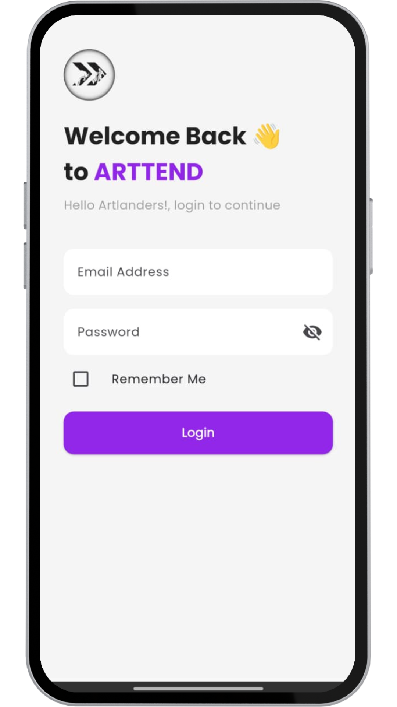
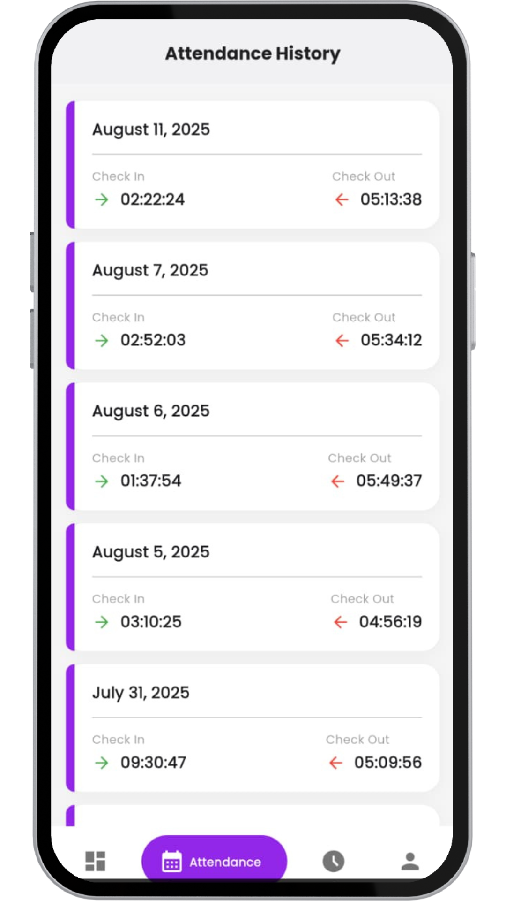

# HR Artugo Mobile


Aplikasi mobile internal **Human Resources (HR)** untuk PT Artugo, dirancang untuk menyederhanakan dan mengotomatisasi berbagai proses HR bagi karyawan. Aplikasi ini terintegrasi langsung dengan backend Odoo, menyediakan data *real-time* dan fungsionalitas yang terpusat.

Aplikasi ini dibangun menggunakan Flutter, memungkinkan *codebase* tunggal untuk berjalan di platform Android dan iOS secara *native*.

---

## 🖼️ Tampilan Aplikasi (Screenshots)

| Login | Dashboard | Absensi |
| :---: | :---: | :---: |
|  |  |  |

---

## ✨ Fitur Utama (Key Features)

- **Otentikasi Pengguna**: Proses login dan manajemen sesi yang aman terhubung langsung ke database pengguna Odoo.
- **Absensi (Check-in & Check-out)**:
    - Fitur absensi dengan validasi **geolokasi (GPS)** untuk memastikan karyawan berada di lokasi yang tepat.
    - Kewajiban mengunggah **foto selfie** saat absensi sebagai bukti kehadiran.
    - Data absensi dikirim dan disimpan secara *real-time* ke modul `hr_attendance` di Odoo.
- **Manajemen Cuti (Time Off)**:
    - Melihat riwayat dan detail pengajuan cuti.
    - Informasi detail seperti tipe cuti, durasi, dan status persetujuan.
- **Sistem Notifikasi Terpusat**:
    - Menerima notifikasi *push* secara *real-time* dari server Odoo menggunakan **Firebase Cloud Messaging (FCM)**.
    - Melihat daftar riwayat notifikasi (persetujuan cuti, pengumuman, dll).
    - Fitur untuk menandai notifikasi sebagai "sudah dibaca" dan menghapus notifikasi.
- **Pengaturan Aplikasi**:
    - Halaman "Tentang Aplikasi" yang berisi informasi versi.
    - Pengaturan notifikasi (akan dikembangkan).

---

## 🛠️ Teknologi yang Digunakan (Tech Stack)

- **Framework**: [Flutter](https://flutter.dev/)
- **Manajemen State**: [GetX](https://pub.dev/packages/get)
- **Komunikasi Backend**:
    - [odoo_rpc](https://pub.dev/packages/odoo_rpc) untuk komunikasi RPC dengan Odoo.
    - [Dio](https://pub.dev/packages/dio) untuk unggah file (Multipart/Form-Data) pada fitur absensi.
- **Push Notifications**: [Firebase Cloud Messaging](https://pub.dev/packages/firebase_messaging)
- **Notifikasi Lokal**: [flutter_local_notifications](https://pub.dev/packages/flutter_local_notifications)
- **Splash Screen**: [flutter_native_splash](https://pub.dev/packages/flutter_native_splash)
- **Lokasi**: [geolocator](https://pub.dev/packages/geolocator)
- **Backend**: Odoo 14

---

## 🚀 Prasyarat (Prerequisites)

Pastikan Anda telah menginstal perangkat lunak berikut di komputer Anda:
- [Flutter SDK](https://flutter.dev/docs/get-started/install) (versi 3.x atau lebih tinggi)
- [Git](https://git-scm.com/downloads)
- IDE (Visual Studio Code atau Android Studio)

---

## ⚙️ Instalasi dan Konfigurasi

1.  **Clone repository ini:**
    ```bash
    git clone [https://github.com/Aldhaf/hr-artugo-app.git](https://github.com/Aldhaf/hr-artugo-app.git)
    cd hr-artugo-app
    ```

2.  **Konfigurasi Environment**:
    Aplikasi ini memerlukan koneksi ke server Odoo. Buat file `.env` di direktori utama project dan isi sesuai dengan konfigurasi server Anda.
    
    *Buat file `.env` dari contoh ini:*
    ```
    # Odoo Server Configuration
    ODOO_HOST=[https://sys.artugo.co.id](https://sys.artugo.co.id)
    ODOO_DATABASE=nama_database_produksi
    ```
    **File ini sudah termasuk dalam `.gitignore` untuk keamanan.**

3.  **Konfigurasi Firebase**:
    Pastikan Anda sudah menyiapkan project Firebase.
    - **Untuk Android**: Letakkan file `google-services.json` Anda di dalam folder `android/app/`.
    - **Untuk iOS**: Letakkan file `GoogleService-Info.plist` Anda di dalam folder `ios/Runner/`.

4.  **Install dependensi**:
    ```bash
    flutter pub get
    ```

5.  **Jalankan aplikasi**:
    ```bash
    flutter run
    ```

---

## 📂 Struktur Folder

Project ini menggunakan arsitektur modular untuk memisahkan setiap fitur, membuatnya lebih mudah untuk dikelola dan dikembangkan.
```bash
lib
├── core               # Core utilities, themes, etc.
├── main.dart          # Entry point aplikasi
├── module
│   ├── login          # Fitur Login
│   ├── main_navigation  # Navigasi utama (Dashboard, Profile, etc.)
│   ├── notification   # Fitur Notifikasi
│   └── time_off_detail  # Fitur Detail Cuti
├── service            # Service layer (e.g., LocalNotificationService)
└── shared             # Widget, utility, atau kode yang digunakan bersama
```

---

## 🤝 Kontribusi

Saat ini, project ini dikelola secara internal. Namun, jika Anda memiliki saran atau menemukan bug, silakan buat *Issue* di repository ini.

---

## 📄 Lisensi

Project ini dilisensikan di bawah [MIT License](LICENSE).