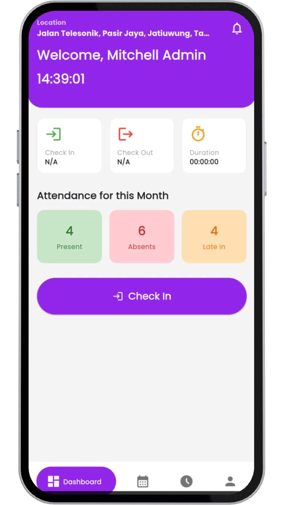

# HR Artugo Mobile (Super App)


Aplikasi mobile internal **Human Resources (HR)** untuk PT Artugo, yang telah bertransformasi menjadi "Super App" karyawan. Dirancang untuk produktivitas maksimal dengan fitur manajemen jadwal shift yang kompleks, absensi berbasis GPS, dan ketahanan jaringan (offline mode). Terintegrasi secara *real-time* dengan backend Odoo 14.

---

## 🖼️ Tampilan Aplikasi (Screenshots)

| Onboarding | Dashboard Modern | Jadwal & Filter | Detail Penolakan |
| :---: | :---: | :---: | :---: |
|  |  |  |  |


---

## ✨ Fitur Utama (Key Features)

### 🏢 Core HR & Productivity
* **Manajemen Jadwal (Shift Roster):**
    * Pengajuan jadwal kerja bulanan/mingguan melalui kalender interaktif.
    * **Filter Canggih:** Filter riwayat berdasarkan pencarian teks, bulan, dan status (Approved/Rejected).
    * **Detail Penolakan:** Melihat alasan penolakan shift langsung dari manager melalui *bottom sheet*.
    * **Pengajuan Ulang:** Kemampuan untuk mengajukan ulang jadwal pada tanggal yang sebelumnya ditolak.
* **Absensi Pintar:**
    * Check-in/Check-out dengan validasi **Geofencing (GPS)** dan deteksi *Fake GPS*.
    * **Optimistic UI:** Perubahan status tombol instan tanpa menunggu loading server.
* **Manajemen Cuti (Time Off):** Pengajuan dan riwayat cuti terintegrasi.

### 🚀 Performa & UX (User Experience)
* **Multi-Bahasa (i18n):** Dukungan penuh Bahasa Indonesia dan Inggris yang dapat diganti secara instan.
* **Tema Gelap (Dark Mode):** Dukungan tema gelap/terang yang persisten.
* **Offline Mode & Caching:**
    * Aplikasi tetap bisa dibuka dan menampilkan data terakhir (cache) saat tidak ada internet.
    * Banner indikator status koneksi ("Anda sedang offline").
* **Onboarding Screen:** Pengenalan fitur untuk pengguna baru (hanya tampil sekali).

### 🔔 Notifikasi
* **Push Notification Visual:** Notifikasi real-time dari Odoo saat jadwal disetujui/ditolak menggunakan Firebase Cloud Messaging (FCM).
* **Konfigurasi Channel:** Mendukung *Notification Channel* Android modern.

---

## 🛠️ Teknologi & Arsitektur

* **Arsitektur**: Modular (memisahkan `view`, `controller`, `model`, `service`, `binding`).
* **State Management**: [GetX](https://pub.dev/packages/get) untuk manajemen state, dependensi, dan rute.
* **Environment Management**: Pemisahan konfigurasi untuk **Dev**, **Staging**, dan **Production**.
* **Networking**: `Dio` dengan *Interceptors* untuk penanganan error dan timeout.
* **Local Storage**:
    * `shared_preferences` untuk cache data ringan dan pengaturan.
    * `flutter_secure_storage` untuk menyimpan token sesi sensitif.
* **Backend**: Odoo 14 (Modul Custom: `hr_attendance_pattern`).

---

## 🌍 Manajemen Lingkungan (Environments)

Aplikasi ini menggunakan *entry points* terpisah untuk memisahkan database dan konfigurasi.

| Lingkungan | Entry Point | Database Odoo | Kegunaan |
| :--- | :--- | :--- | :--- |
| **Development** | `lib/main_dev.dart` | `db_baru_14` | Untuk pengembangan lokal (Localhost/Emulator). |
| **Staging** | `lib/main_staging.dart` | `db_staging` | Untuk pengujian QA di perangkat fisik. |
| **Production** | `lib/main_prod.dart` | `db_prod` | Untuk rilis ke Play Store/App Store (Live). |

### Cara Menjalankan:

**1. Mode Development (Debug):**
```bash
flutter run -t lib/main_dev.dart
```

**2. Mode Staging (Release APK untuk HP Fisik):**
```bash
flutter build apk -t lib/main_staging.dart
```
**3. Mode Production (App Bundle untuk Store):**
```bash
flutter build appbundle -t lib/main_prod.dart --obfuscate --split-debug-info=./debug-info
```

## 🔐 Keamanan (Security)
* **ProGuard/R8:** Diaktifkan untuk mengecilkan dan mengaburkan kode (obfuscation).
* **Certificate Pinning:** (Direncanakan).
* **Secure Storage:** Token otentikasi tidak disimpan di plain text.
* **Git Ignore:** File sensitif seperti key.properties, serviceAccountKey.json, dan keystore (*.jks) TIDAK disertakan dalam repository ini demi keamanan.

## 📦 Setup Backend (Odoo)
Aplikasi ini membutuhkan modul Odoo kustom hr_attendance_pattern yang menangani:
* 1. Logika Shift Roster & Batch Submission.
* 2. Logika Shift Roster & Batch Submission.
* 3. Logika Shift Roster & Batch Submission.
**Dependensi Python Server:**
```bash
pip install firebase-admin
```
Pastikan file serviceAccountKey.json diletakkan di lokasi aman di server dan path-nya dikonfigurasi di __init__.py modul.

## 🤝 Kontribusi
Project ini dikelola secara internal.
* Branch main: Kode produksi stabil.
* Branch develop: Integrasi fitur baru.
* Branch feature/...: Pengembangan fitur spesifik.

## 📄 Lisensi
Copyright © 2025 PT Kreasi Arduo Indonesia (Artugo). All Rights Reserved.